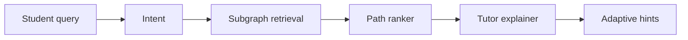

# 03 - Knowledge Graph Reasoning Tutor

[](https://github.com/milos-plavsic/knowledge-graph-tutor/actions/workflows/ci.yml)
[](https://www.python.org/downloads/)

An interactive tutor that combines a knowledge graph with LLM guidance to produce step-by-step, path-based explanations and adaptive hints.

## Quickstart

```bash
make install
make run
make api
make test
```

Docker API: `make docker-api`.

## API

- OpenAPI docs: `http://127.0.0.1:8000/docs`
- Health: `GET /health`
- Explain: `POST /v1/explain` with JSON body `{"topic":"..."}`

## Architecture



## Why This Project Stands Out

- Highlights graph reasoning beyond plain vector retrieval.
- Makes reasoning traceable via explicit node/edge paths.
- Supports educational use cases with adaptive difficulty.

## Core Capabilities

- Topic graph ingestion from curated curriculum material.
- Query-to-subgraph retrieval and path scoring.
- Stepwise explanation synthesis grounded in graph paths.
- Contradiction detection for conflicting concept routes.
- Personalized hints using learner state and mistake history.

## Suggested Tech Stack

- Python 3.11+
- `networkx` or Neo4j, `sentence-transformers`, `langgraph`, `fastapi`
- Visualization: PyVis or D3 via lightweight frontend

## Architecture (Graph)

`student_query -> intent_detector -> subgraph_retriever -> path_ranker -> tutor_explainer -> misconception_checker -> adaptive_hint_generator -> response`

## Usage Suggestions

- Start with one domain (e.g., linear algebra or system design).
- Keep concept prerequisites explicit in edges for better path quality.
- Add "show why" button to reveal exact path used in answer.

## Portfolio Additions

- Animated graph traversal during answer generation.
- Performance breakdown by query complexity.
- A/B test path-based answers vs plain RAG answers.

## Milestones

- `v0.1`: static graph + path explanation.
- `v0.2`: adaptive hinting and misconception checks.
- `v0.3`: visualization and lesson memory.
- `v1.0`: multi-domain support and deployment.

## Demo Scenarios

1. Explain backpropagation from calculus prerequisites.
2. Resolve confusion between overfitting and underfitting.
3. Provide a custom study plan for weak graph regions.
