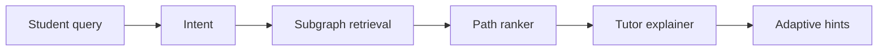

# 03 - Knowledge Graph Reasoning Tutor

[](https://github.com/milos-plavsic/knowledge-graph-tutor/actions/workflows/ci.yml)
[](https://www.python.org/downloads/)

An interactive tutor that combines a knowledge graph with LLM guidance to produce step-by-step, path-based explanations and adaptive hints.

## Real-world data (education sector)

The demo uses a small **STEM prerequisite graph** bundled as `data/stem_prereqs.json` (illustrative secondary progression: algebra → functions → kinematics → energy/momentum). For curriculum context, see [Next Generation Science Standards](https://www.nextgenscience.org/) and typical secondary math/science scope sequences used in many US districts (graph is a simplified teaching aid, not student-level records).

## Quickstart

```bash
make install
make run
make api
make test
```

Docker API: `make docker-api`.

## API

- OpenAPI docs: `http://127.0.0.1:8000/docs`
- Health: `GET /health`
- Explain: `POST /v1/explain` with JSON body `{"topic":"..."}`
- Graph export: `GET /v1/graph/export` (nodes and prerequisite edges)
- UI: `/ui` renders an interactive prerequisite graph (vis-network)

## Architecture


```mermaid
flowchart LR
  Q[Student query] --> I[Intent]
  I --> S[Subgraph retrieval]
  S --> P[Path ranker]
  P --> T[Tutor explainer]
  T --> H[Adaptive hints]
```

## Core Capabilities

- Topic graph ingestion from curated curriculum material.
- Query-to-subgraph retrieval and path scoring.
- Stepwise explanation synthesis grounded in graph paths.
- Contradiction detection for conflicting concept routes.
- Personalized hints using learner state and mistake history.

## Architecture (Graph)

`student_query -> intent_detector -> subgraph_retriever -> path_ranker -> tutor_explainer -> misconception_checker -> adaptive_hint_generator -> response`
